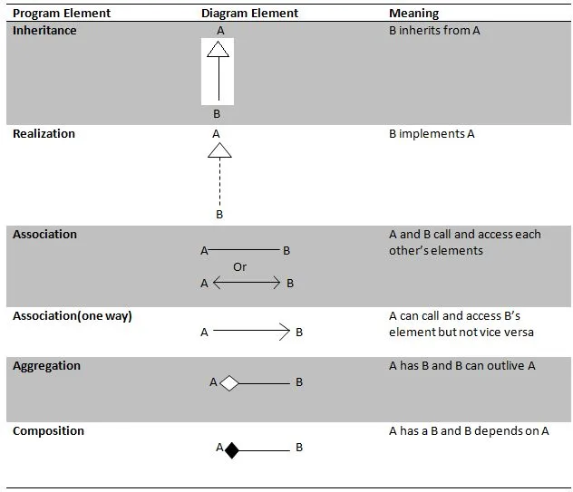

# Classes

 - Acts as a blueprint for Objects.
 - Has properties and methods known as attributes and behaviour/operations, collectively as members.

#### Related terms
 - Contract provides which services are provided. Clients only need to know the contracts.
 - Implementation provides how the service is provided.

## Objects
 - An object is an instance of a class.
 - The process of creating an object from a class is called instantiation.
 - An object upon creation returns a reference value.
 - This value can only be stored in an object reference(simply reference).
 - The UML of objects are same as classes except references with a colon is prefixed to the class name.

## Instance Members
 - The object's fields and methods are collectively called as instance members.
 - This is different from static members.
 - The instance fields and methods belongs to the object, however the methods' impl is shared by all 
instances of a class.

## Static Members
 - These members belong to the class rather than objects.
 - They're also called class members(fields/methods).
 - Represented in class diagram with an underline.
 - Static Members can be accessed via both Class name and object references(not encouraged).

## Reusing Classes
There two ways of re-using class code. 
 1. Inheritance
 - The extended class is called subclass or generalization and extending class is called superclass or specialization.

 2. Aggregation
 - Aggregation of classes means that one object is having the instance of another of object of another class.

### UML Notation

