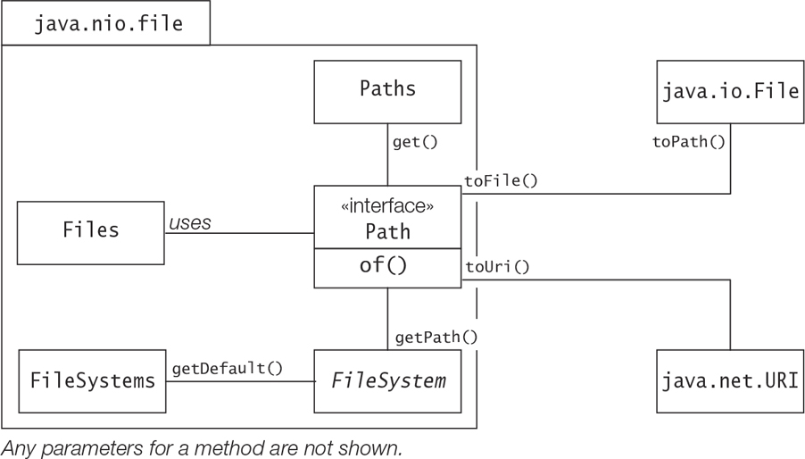

## Path

### Creating Path Objects
 - File Operations that a java program invokes are performed on a File System.
 - We can construct a specific file System by the factory method of __java.nio.file.FileSystems__ utility class.
 - If not using any specific file system, the default file system(local file system) will be used.
 - The default file system(local) is platform specific and can be obtained as an instance of the java.nio.file.FileSystem
abstract class by invoking the getDefault() factory method of the FileSystems utility class.

```
   FileSystem dfs = FileSystems.getDefault();     // The default file system
```
 - We can use this to query various file system properties.
 - If the method _getDefault_ is called several times, it returns the same FileSystem instance for the default file system.
```
    abstract String getSeparator()         Declared in java.nio.file.FileSystem
```
 - Returns the platform-specific name separator for name elements in a path, represented as a string.
 - Paths in the file system are programmatically represented by objects that implements Path interface.
 - The Path interface and various other classes provide factory methods that create Path objects. A Path object is also 
platform specific.
 - A Path object implements the Iterable<Path> interface, meaning it is possible to traverse over its name elements from
the first name element to the last. It is also immutable and therefore thread-safe.
 - A Path object can be queried and manipulated in various ways, and may not represent an existing directory entry in 
the file system. A Path object can be used in file operations to access and manipulate the directory entry it denotes in
the file system.
 - The java.nio.file.Path interface, java.io.File class and java.net.URI classes ae interoperable.
```
    static Path of(String first, String... more)
    static Path of(URI uri)
```
 - These methods are declared in the java.nio.file.Path interface.
```
    abstract Path getPath(String first, String... more)
```
 - This method is declared in the java.nio.file.FileSystem class.
```
    static Path get(String first, String... more)
    static Path get(URI uri)
```
 - These static methods are declared in the java.nio.file.Paths class.
```
    Path toPath()
```
 - This method is declared in the java.io.File class.


#### Creating Path Objects with the Path.of() Method
 - Using the __Path.of(String first, String... more)__ returns a path object where the first String and all the string in
_more_ variable arity parameter are joined together using the default file-system's file name separator.
 - System.getProperty("user.dir") can be used to get the absolute path of the program on the platform and this value can
be used to create relative path by using it as the first in Path.of method.

##### Creating Path Objects with the Paths.get() Method
 - Paths.get(String, String...) method also invokes Path.of(String, String...) method.

##### Creating Path Objects Using the Default File System
 - The Path.of(String first, String... more) method is a convenience method that invokes FileSystem.getPath() method to
obtain a Path Object.

#### Interoperability with the java.io.File Legacy Class
 - The java.io.File can be used to query the file system about a file/directory or to create, rename, delete directory 
entry in a file system.
 - The __Path__ interface and the File class have overlap in functionality, yet the Path interface is recommended for new code.
 - Anyway, File and Path is interoperable, thereby overcoming the limitations of legacy class File.

```
    File(String pathname)
    Path toPath()
```
 - The above can be used to create a file using the pathname in the constructor and then can be converted to the path object.
```
    default File toFile()
```
 - The above function can be used to convert the path object back to the file object.

#### Interoperability with java.net.URI class
 - A URI locates a unique resource on local or remote system via a address String which also specifies a protocol to handle
the resource(http, ftp etc)
```
    file:///a/b/c/d                      // Scheme: file, to access a local file.
    http://www.whatever.com              // Scheme: http, to access a remote website.
```

```
    URI(String str) throws URISyntaxException
    static URI create(String str)
```
 - The above methods are used to create a URI object. The second method is preferred when it is known that the URI string
is well formed.

```
    // URI --> Path, using the Path.of(URI uri) static factory method.
    Path uriToPath1 = Path.of(uri1);       // /a/b/c/d
    
    // URI --> Path, using the Paths.get(URI uri) static factory method.
    Path uriToPath2 = Paths.get(uri1);     // /a/b/c/d 
```
 - The Path and URI object are interoperable, using the above methods. Paths.get(URI) actually invokes Path.of(URI)
```
    // Path --> URI, using the Path.toUri() instance method.
    URI pathToUri = uriToPath1.toUri();    // file:///a/b/c/d
```