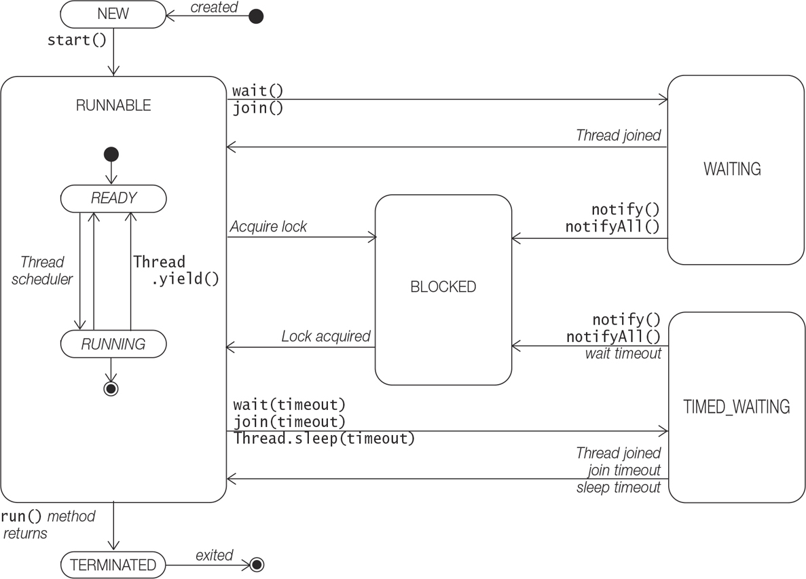
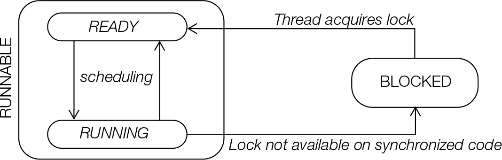

### Thread Lifecycle

#### Objects, Monitors, and Locks
 - Each object, including arrays has a monitor associated with it.
 - A thread can lock and unlock a monitor of an object, but only one thread at a time can acquire the lock.
 - The thread that acquires the lock is said to own the lock and has exclusive access to the object.
 - Any other thread trying to acquire lock will be placed in the entry set of the monitor until the lock is released and 
these thread will be in blocked state.
 - If the entry set is having multiple threads, a blocked thread is allowed to acquire the lock at the discretion of JVM,
based on the scheduling policy in effect.
 - This locking mechanism thus implements mutual exclusion (or mutex).
 - We cannot assume any order for the threads in the entry set to acquire the locks.
 - This locking mechanism on monitor can be referred by names : intrinsic lock, monitor lock, object-level lock, monitor or just lock.
 - Classes also have a lock on java.lang.Class object, that represents the class at runtime in the JVM. Given a class A, the unique class object is A.class

The following static method of the Thread class can determine whether the current thread holds a lock on a specific object :
```
   static boolean holdsLock(Object obj)
```

#### Thread States
- Threads can exist in different states. The thread states are represented by enum constants and the state of the current
thread can be found by the method getState() which returns a constant type of Thread.State(State is a static inner enum type)



| Constants in Thread.State enum | Description of the State                                                                                                                                                                                      |
|--------------------------------|---------------------------------------------------------------------------------------------------------------------------------------------------------------------------------------------------------------|
| NEW                            | A thread in this state has been created but not yet started                                                                                                                                                   |
| RUNNABLE                       | The Runnable state has two substates which are not observable :                                                                                                                                               |
| READY substate                 | A thread life starts in the READY substate, and also when it transitions from a non-runnable state to the RUNNABLE State                                                                                      |
| RUNNING Substate               | If a thread is in the RUNNING Substate, it means that the thread is currently executing                                                                                                                       |
| BLOCKED                        | A Thread is in blocked state while waiting to acquire a lock or for I/O.                                                                                                                                      |
| WAITING                        | A thread is in this state indefinitely until what it is waiting for occurs 1. For join completion, awaits completion of the other thread. 2. Waiting for notification, awaits notification from other thread. |
| TIMED_WAITING                  | A Thread is in this state for atleast a specified amount of time: 1. Timed waiting for join completion, 2. Timed Waiting for notification, 3. Timed waiting to wake up from sleep                             |
| TERMINATED                     | The run() method completed execution or terminated. Once here, a thread can never run again                                                                                                                   |

- Being non-observable of RUNNABLE Substate means that once in this state it is not possible to distinguish which substate the thread is in.
- WAITING, TIMED_WAITING, BLOCKED states are non-runnable states. A running thread - one in running substate can transit to one of the non-runnable state, depending on the circumstances.
- Any thread doesn't directly go to the RUNNING Substate from a non-RUNNABLE state but first to the READY Substate.

A few selected methods from the Thread class :
```
   final boolean isAlive()
   // A thread is alive if it has been started but not terminated yet
   
   Thread.State getState()
   // Returns the current state of the thread. This should be used for monitoring and not for synchronizing
   
   final int getPriority()  //gets the new priority 
   final void setPriority(int newPriority)
   //The priority set will be minimum of the specified newPriority and the maximum priority permitted for this thread
   //There is no guarantee that a thread with a higher priority will be chosen to run.
   
   static void yeild()
   //Cause the current thread to temporarily pause its execution. The transition here is from the RUNNING substate to the READY substate and it is upto the JVM to decide if and when this transition will take place.
   
   
   static void sleep(long millisec) throws InterruptedException
   static void sleep(long millisec, int nanos) throws InterruptedException
   // Makes the Current thread sleep for the specified time 
   // The transition is from the RUNNING substate of the RUNNABLE state to the TIMED_WAITING state

   final void join() throws InterruptedException
   final void join(long milli) throws InterruptedException
   // A call to any of these two methods invoked on a thread will wait and not return until either the thread has completed or it is timed out after the specific time.
   // In the first method, the transition is from the RUNNING substate of the RUNNABLE state to the WAITING state
   // In the second method, the transition is from the RUNNING substate of the RUNNABLE state to the TIMED_WAITING state.
   
   static Map<Thread, StackTraceElement[]> getAllStackTraces()
   //Returns a map of stack traces of all alive threads. Each thread has its own execution stack.
```


#### Thread Priorities
- Threads are assigned priorities that the JVM can use to determine how the threads will be scheduled. The threads in the READY substate are scheduled based on their priority, but this is not guaranteed as scheduling is platform dependent.

##### Selective priorities defined by enum constants in the Thread class
|Enum type java.lang.Thread|value|Description|
|--------------------------|-----|-----------|
|MIN_PRIORITY|0|Lowest Priority|
|NORM_PRIORITY|5|Default Priority|
|MAX_PRIORITY|10|Highest Priority|

- A thread inherits the priority of its parent thread. The default text representation of a thread is __[thread_name, priority, parent_thread_name]__
- The setPriority() method is an advisory method, that it provides hint to the JVM, and JVM is no way obliged to honor. This method can be used to fine tune the performance, but should not be relied upon for the correctness of the program.
- The higher priority of a thread in no way implies that it will be executed first.


##### Thread Scheduler
Schedulers in JVM _usually_ employ one of the two strategies, which comes into play in the RUNNABLE state:
- Preemptive scheduling -> If a thread with higher priority than the current running thread moves to the READY substate, the current running thread can be preempted(moved from the RUNNING substate to the READY substate) to let the higher-priority thread execute.
- Time-sliced or round-robin scheduling -> A running thread is allowed to execute for a fixed length of time in the RUNNING substate, after which it moves to the READY substate to await its turn to run again.

Thread schedulers are implementations and are platform-dependent; therefore how threads will execute is unpredictable.

##### Starting a Thread
- After the creation of a thread, it is NEW state.
- To start the thread, we call the start() method which transits the thread state from NEW state to READY substate, and this method is asynchronous, that is, it returns immediately.


##### Running and Yeilding
- A call to the static method yeild(), defined in the Thread class, may cause the Thread in the RUNNING substate transits to the READY substate. If this happens, then the thread is at the mercy of the thread scheduler as when it will start executing again.
- It is possible that if no thread is in the READY substate, the current thread will keep on executing. Else the priorities can influence the scheduling.
- As with setPriority() method, the yeild() method is also an advisory method, and therefore there's no guarantee that the call will be honoured by the JVM.
- A call to yeild() method does not affect any locks that the thread might hold.

A typical example is when a user has initiated a cpu-intensive task and has an option of cancelling the task, in that case it might be possible that the cancellation process will take some time, as th le thread responsible for taking input won't be getting any chance to execute.
An ideal process would be to yeild in between computations, to let the other threads execute.


##### Executing Synchronized code
- synchronization in java is a way to write thread-safe code, that is, allowing access to a critical section one at a time to the threads.
- The keyword _synchronized_ and intrinsic lock mechanism form the basis for implenting the synchronized execution of code.
- The synchronized keyword can be declared on the method or on a crtain section of code. The synchronized block of code is called the critical section.

##### Acquiring the Object lock
- In order to execute the synchronized code, the thread must acquire the lock, if the object is already locked, the thread transits to the BLOCKED state.
- These threads are put in the entry set of the object. In the blocked state, the threads are grouped according to the object whose lock they're waiting for.
- If there're multiple thread waiting for the lock, one is chosen at the discretion of the JVM, which then transits to the READY substate.



##### Synchronized Methods
- If a method is meant to be executed by only one thread at a time, then these methods can be declared with the synchronized keyword.
- A thread wishing to execute the synchronized method must first acquire the object lock and is simply achieved by calling the method. If the lock is already held by another thread, the thread is put into the entry set of the object.
- No special action is required on the program part for the object lock acquisition. A thread releases the lock on method return, regardless of whether the execution is completed or it threw an uncaught exception.
- In case an uncaught exception is thrown, the exception is propagated through the JVM stack.
- Race condition (or Thread interference) is inevetable where a non-stnchrinized method is changing a shared value and multiple threads re accessing this method.


##### Reentrant Synchronized
- While a thread is inside a synchronized method of an object, all other threads that wish to execute this synchronized method or any other synchronized method will have to wait in the entry set, as the entire object is locked.
- A thread already executing a synchronized method of an object, i.e. already has the lock, and can invoke other synchronized methods of the same class directly or indirectly without being locked.
- A thread already having a lock on an object, it can acquire the lock on the same object several times called reentrant synchronisation. The __non-synchronized__ methods of the object can always be called at any time by any thread.

##### Synchronization on Class Lock
- Executing a static synchronized method involves acquiring and releasing a class lock. A thread acquires a class lock before executing any static synchronized method, thereby blocking any other thread wishing to execute any static synchronized method of the same class.
- The static __non-synchronized__ method can be called by any thread at any time. Acquiring a class lock is different from acquiring an object lock, meaning threads blocked for executing non-static synchronized methods are not affected by thread executing static synchronized methods.
- A subclass decides whether the new definition of an inherited synchronized method will remain synchronized in the subclass.

##### Synchronized statements
- Like the synchronized method of an object gets executed by acquiring a lock on the object, the synchronized statement allows the execution of arbitrary code to be synchronized on the lock of an arbitrary object.
- The general form is :
```
   synchronized (object_referenece_expression) {code_block}
```
- The object reference must evaluate to a non-null reference value, otherwise, a NullPointerException is thrown.
- The code block is usually related to the the object whose lock is acquired.
- Once a thread has entered the code block after acquiring the lock on the specified object, no other thread will be able to execute the code block, or any other code requiring the same object lock, until the lock is released.
- The curly brackets of the block cannot be ommited, even if the code block has just one statement.
- The object reference in the synchronized block is mandatory, we may choose to synchronize the execution part of a method by using _this_ reference.
- <ClassName>.this is the object of the class referred within the object or maybe inner class of the current class.
- For cases wherein we've inner classes and method within them is altering an outer class variable, we can use the above concept.

A synchronized statement can ve specified on a class lock:
```
   synchronized (<class_name>.class) {<code_block>}
```
- <class_name>.class object represents the class at runtime.

##### In summary, a thread can acquire a lock by the following mechanism:
1. By executing, synchronized method of an object to hold the object lock, or by executing the static synchronized method of a class to acquire the class lock.
2. By executing a synchronized statement, the required class or object lock is acquired.
3. Intrinsic lock acquisition is rigid, that is either the thread acquires the lock immediately if it is available, or the thread has to wait its turn among the waiting threads. There is no lock acquisition policy.
4. The intrinsic lock is acquired and released in the same synchronized code. It cannot be acquired or released in separate methods.

##### Interrupt Handling
The following method interrupts the thread on which it is invoked :
```
   void interrupt()
```

- If the thread is in non-runnable state, either blocked or waiting, the interrupt status of the thread is cleared and the thread will receive an __InterruptedException__ when it gets to run.
- For a thread that is in a Runnable state, the interrupt status of the thread will be set and no exception will vlbe thrown.
```
   boolean isInterrupted();    //checks whether interrupted, interrupt status is not affected.
   static boolean interrupted();  //checks the status and interrupt status is cleared
```
- To handle when interrupted, the methods isInterrupted() should be called for query, and necessary actions can be taken, or use the try and catch for __InterruptedException__ when in non-runnable state.

##### Sleeping and Waking up
- A call to the static method sleep() in the Thread class will cause the currently running thread to temporarily pause its execution and transits to the __TIMED_WAITING__ state.
- The getState() method will return the value Thread.State.TIMED_WAITING.
- The Thread is guaranteed to sleep atleast for the time specified in its argument, but it might sleep a little longer, before coming back to the READY state.
- The sleep method won't release any locks that the thread might have.


##### Thread coordination
- The methods wait(), notify()/notifyAll() are used for low-level thread coordination, are error-prone and challenging to get right and should be avoided in favor of the high-level concurrency support provided by the java.util.concurrent package.
- Waiting and notifying provides coordination between threads that synchronize on the same object - also called data access synchronization. All Objects inherit these methods.
- These methods can only be executed on an object whose lock the thread holds,(i.e. in synchronized code), otherwise the call will result in __IllegalMonitorStateException__.
- The object releases the lock of the object and transits itself into WAITING or TIMED_WAITING, based on whether wait() or wait(time) is called.
```
   final void wait(long timeout) throws InterruptedException
   final void wait(long timeout, int nanos) throws InterruptedException
   final void wait() throws InterruptedException
   
   // A thread invokes the wait method on the object whose lock it holds and the thread releases the object lock and is added to the wait set of the current object until the notify() or notifyAll method
   // is called by the thread currently holding lock on the object or the specified timeout occurs.
   
   final void notify()
   final void notifyAll()
   // A thread invokes a notification method on the current object whose lock it holds to notify thread(s) that are in the wait set of the object. After being notified, a thread will still need to reacquire the monitor before it can continue execution.
   // notifyAll() method notifies all the thread in the wait set.
```

##### Waiting
- A thread usually calls the wait method on the object whose lock it holds because the condition for its continued execution was not met.
- The thread leaves the RUNNING substate and transits to the __WAITING__ or __TIMED_WAITING__ state, depending on whether a timeout was specified.
- The thread releases the ownership of the object lock. Transitioning to a waiting state and releasing the object lock are completed as one atomic(non-interruptible) operation.
- The waiting thread only releases the lock of the object on which wait() method was invoked, and does not releases any other object lock that it might hold.
- Each object has a wait set containing threads waiting for notification. Threads in a waiting state are grouped according to the object whose wait() method they invoked.
- A thread in a waiting state can be awakened by the occurrence of any one of these events:
1. Another thread invokes the notify() method on the object of the waiting thread, and the waiting thread is selected as the thread to be awakened.
2. The waiting thread times out if it was a timed wait.
3. Another thread interrupts the waiting thread.
4. A spurious wakeup occurs.

##### Notify
 - Invoking the notify() method on an object wakes up a single thread that is waiting for the lock of this object. 
The selection of a thread to awaken is dependent on the thread policies implemented by the JVM.
 - On being notified, a waiting thread first transits to the BLOCKED state to acquire the lock on the object, and not directly to the READY substate of the RUNNABLE state.
 - The thread is also removed from the wait set of the object. Note that the object lock is not released when the notifying thread invokes the notify() method. 
 - The notifying thread releases the lock at its own discretion, and the awakened thread will not be able to run until the notifying thread releases the object lock.
 - When the notified thread obtains the object lock, it is enabled for execution, waiting in the READY substate for its turn to execute again. 
Finally, when it does execute, the call to the wait() method returns and the thread can continue with its execution.
 - The threads transitioning from WAITING to BLOCKED have no privileges, and must compete with any other threads blocked for lock acquisition.
 - A call to the notify() method has no effect if there are no threads in the wait set of the object.
 - In contrast to the notify() method, the notifyAll() method wakes up all threads in the wait set of the shared object. 
 - They will all transit to the BLOCKED state, and contend for the object lock as explained earlier.
 - It should be stressed that a program should not make any assumptions about the order in which threads awaken in response to the notify() or notifyAll() method, or transit to the BLOCKED state for lock acquisition.
 - If timeout is specified in the wait method, the awakened thread has no way of knowing whether it was timed out or awakened by one of the notification methods.

##### Interrupt waking
 - By calling the _interrupt_ method of the thread, by another thread, the thread goes to the BLOCKED state and whenever it gets a chance to run, it results in an InterruptedException.

##### Spurious WakeUp
 - In very rare cases, a thread in a waiting state is awakened by what is called a spurious wakeup, which is not due to familiar events like being notified, timed out, or interrupted.
 - But due to deep-level system signals warranting a wakeup call to the waiting threads. 
 - The condition on which the thread was waiting might not have been fulfilled when the thread wakes up from a spurious wakeup, and should therefore be rechecked when the thread gets to run. 
 - This is done by testing the condition in a loop that contains the wait() call, as the thread can go right back to waiting if the condition is not satisfied.
```
while (conditionNotSatisfied()) {
  ...
  wait();
  ...
}
// Proceed ...
```

##### Joining
 - A thread can invoke the overloaded method join() (from the Thread class) on another thread in order to wait for the other thread to complete its execution before continuing.
 - If t1 calls join on t2, t1 waits for the completion of t2, if not completed, if already completed then no effect is observed.
 - Depending on whether timeout is specified or not, the state of the thread could be __WAITING__ or __TIMED_WAITING__.
 - Based on thread completion or getting timed_out or interrupted, the thread transits to __READY__ substate.

##### BLOCKED FOR IO
 - A running thread, on executing a blocking operation requiring a resource (like a call to an I/O method), will transit to the BLOCKED state. 
 - The getState() method on this thread will return the value Thread.State.BLOCKED. When the thread can complete the blocking operation, it proceeds to the READY substate.
 - 