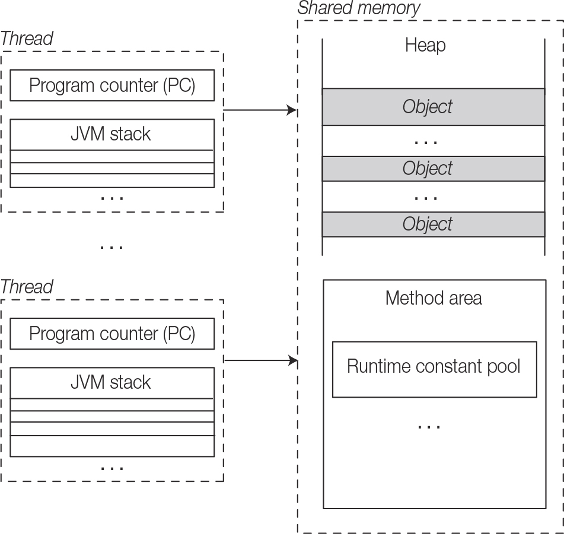

## Chapter topics :
1. Distinguish between concurrency and parallelism
2. Runtime organization for threads execution : What is shared memory and what is private to a thread
3. Creating threads by extending the Thread class or implementing the Runnable interface.
4. Writing synchronized code, either using synchronized methods or statements.
5. Managing thread lifecycle: thread states, the transition between them, and thread coordination
6. Thread problems : liveness, fairness, deadlock, starvation, livelock, and memory consistency errors.
7. Guaranteed and non-guaranteed behaviour of a thread.

Multithreading attempts to utilise the benefits of a multiprocessor architecture.

### Threads and Concurrency
#### MultiTasking
1. Process based multitasking
2. Thread based multitasking

Thread is an independent sequential path of execution within the program, and all threads within a program exist in a 
common memory space, and can therefore share both data and code.

Advantages of thread based multitasking :
1. Threads share the same address space - that is global data is accessible to all threads.
2. Context switching between threads is usually less expensive than between processes
3. The cost of coordination between threads is relatively low.

__Thread Safety__ is the term used to describe the design of classes that ensure that the state of their objects is 
always consistent, even when the objects are used concurrently by multiple threads.
Parallelism means the process are executed simultaneously at different cores. Concurrency, however, is a more general term.

Concurrency means the threads maybe getting executed parallelly or concurrently(sharing the same core).

On a multitasking OS, it is almost unpredictable when the threads will be executed, how (concurrently/parallelly) and 
how much of time will be allocated. This is because alot of processes are running on an OS. 
These factors have very important consequences:

1. Execution of code in different threads is unpredictable.
2. A thread that started earlier may or may not complete its work sooner than the thread that started later, even if it has less work to do.
3. Any attempt to control exact execution order will very likely impact performance and may result in all sorts of unwanted side effects.

Since the execution order is highly unpredictable, it is best not to control and embrace the stochastic nature of concurrent code execution, else performance will be degraded.

#### Runtime organization for Threads Execution

Most JVM implementations run as a single process, but allow multiple threads to be created.

The JVM has designated memory areas, called runtime data areas, that are deployed

Each thread has the following data areas, which are private to the thread :

1. JVM Stack : A JVM Stack (also known as execution stack, call stack, or frame stack) is created for each thread when 
the thread starts and is used for bookkeeping method executions in the thread. This is also  where all the local variables
for each active method invocation are stored. Note that each thread takes care of its own exception handling, and thus 
not affect other threads.
2. Program Counter (PC) : This register is created for each thread when the thread starts, and stores the address of the
JVM instruction currently being executed.

The following data areas are shared by all threads :

1. **Heap** : This shared memory space is where objects are created , stored, and garbage collected.
2. **Method area** : This is created when the JVM starts. It stores runtime constant pool, field and method information,
static variable, and method bytecode for each class and interface loaded by the JVM.
3. **Runtime constant pool**: In addition to storing the constants defined in each class and interface, this also stores
references to all method and fields. The JVM uses the information in this pool to find the actual address of a method or a field in memory.

