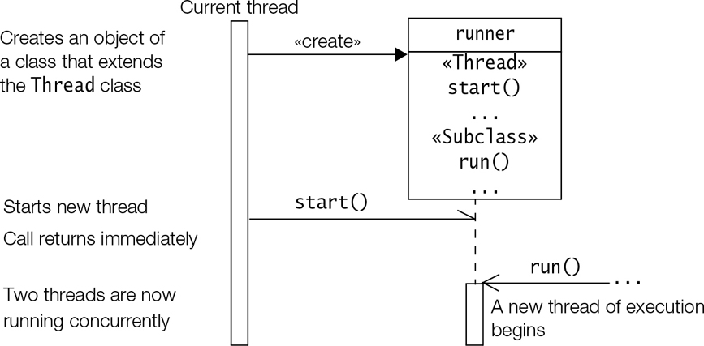

## Chapter topics :
1. Distinguish between concurrency and parallelism
2. Runtime organization for threads execution : What is shared memory and what is private to a thread
3. Creating threads by extending the Thread class or implementing the Runnable interface.
4. Writing synchronized code, either using synchronized methods or statements.
5. Managing thread lifecycle: thread states, the transition between them, and thread coordination
6. Thread problems : liveness, fairness, deadlock, starvation, livelock, and memory consistency errors.
7. Guaranteed and non-guaranteed behaviour of a thread.

Multithreading attempts to utilise the benefits of a multiprocessor architecture.

### Threads and Concurrency
#### MultiTasking
1. Process based multitasking
2. Thread based multitasking

Thread is an independent sequential path of execution within the program, and all threads within a program exist in a 
common memory space, and can therefore share both data and code.

Advantages of thread based multitasking :
1. Threads share the same address space - that is global data is accessible to all threads.
2. Context switching between threads is usually less expensive than between processes
3. The cost of coordination between threads is relatively low.

__Thread Safety__ is the term used to describe the design of classes that ensure that the state of their objects is 
always consistent, even when the objects are used concurrently by multiple threads.
Parallelism means the process are executed simultaneously at different cores. Concurrency, however, is a more general term.

Concurrency means the threads maybe getting executed parallelly or concurrently(sharing the same core).

On a multitasking OS, it is almost unpredictable when the threads will be executed, how (concurrently/parallelly) and 
how much of time will be allocated. This is because alot of processes are running on an OS. 
These factors have very important consequences:

1. Execution of code in different threads is unpredictable.
2. A thread that started earlier may or may not complete its work sooner than the thread that started later, even if it has less work to do.
3. Any attempt to control exact execution order will very likely impact performance and may result in all sorts of unwanted side effects.

Since the execution order is highly unpredictable, it is best not to control and embrace the stochastic nature of concurrent code execution, else performance will be degraded.

#### Runtime organization for Threads Execution

The JVM has designated memory areas, called runtime data areas, that are deployed for various purpose during program execution.
The below image is of Runtime Data Areas.


Most JVM implementations run as a single process, but allow multiple threads to be created.

Each thread has the following data areas, which are private to the thread :

1. JVM Stack : A JVM Stack (also known as execution stack, call stack, or frame stack) is created for each thread when 
the thread starts and is used for bookkeeping method executions in the thread. This is also where all the local variables
for each active method invocation are stored. Note that each thread takes care of its own exception handling, and thus 
not affect other threads.
2. Program Counter (PC) : This register is created for each thread when the thread starts, and stores the address of the
JVM instruction currently being executed.

The following data areas are shared by all threads :

1. **Heap** : This shared memory space is where objects are created , stored, and garbage collected.
2. **Method area** : This is created when the JVM starts. It stores runtime constant pool, field and method information,
static variable, and method bytecode for each class and interface loaded by the JVM.
3. **Runtime constant pool**: In addition to storing the constants defined in each class and interface, this also stores
references to all method and fields. The JVM uses the information in this pool to find the actual address of a method or a field in memory.

#### Creating Threads
- A thread in java is represented, created and controlled by an object of class __java.lang.Thread__ .

Implementing the task performed by a thread is achieved in one of the two ways :

1. Implementing the functional interface java.lang.Runnable
2. Extending the java.lang.Thread class.

##### Implementing the Runnable interface
The Runnable interface has the following specification:

```java
    @FunctionalInterface
    public interface Runnable {
       void run();
    }
```

 - A thread object which is created based on an object that implements the Runnable, will execute the code in the public method run().
 - A thread ends when the run() method ends, either by normal completion or by throwing an uncaught exception. The run method doesn’t 
return a value, don't have a parameter, and does not throw any checked Exception.
 - The Runnable interface is a Functional Interface, and can also be implemented by a lambda expression, typically for simple tasks.

1. Either create an object of a class implementing the Runnable interface with the run method or provide a lambda expression
to the Thread constructor instead of the object.
2. To start the thread we call the start() method on the thread object, and the method returns instantly without waiting
for the thread to complete it’s execution. In other words, the call to start() method is asynchronous.

The run method is the entry and exit of the thread.

A few selected constructors and methods from the java.lang.Thread class are :

```
    Thread(Runnable threadTarget)
    Thread(Runnable threadTarget, String threadName) // threadName is put as the name instead of the automatically generated one.
```

```
    void start()
```

Spawns a new thread - this new thread will begin execution as a child thread of the current thread. The spawning is done
asynchronously as the call to start is returned instantly. It throws an IllegalThreadStateException if the thread is already
started or it has already completed execution.

```
    void run()
```

This method in the Thread class, which implements Runnable interface, is empty. The extending class must override the logic
in this method. If the thread is created using a separate Runnable implementing object, then the run method of the Runnable object is called.

```
    static Thread currentThread()
```

The above returns a reference to the Thread object of the currently executing thread.

```
    final String getName()
    final void setName(String name)
```

The first method gets the name of the current thread and the second method sets the name to the argument.

```
    final void setDaemon(boolean flag)
    final boolean isDaemon()
```

 - The first method sets the status of the Thread before starting it. The second method returns whether the thread is daemon or not.
 - The start() method can be called only once on a Thread object. Once called, subsequent calls will throw IllegalThreadStateException.
 - If the same object of the class implementing Runnable, when passed to multiple different threads, all of the threads operate.
on the same run method of the same object as the object are in heap which is a shared memory area. Meaning same operation shall be 
executed and same variables shall be changed.
 - In the above case, if the shared variables are not synchronized, then the __thread interference__ might occur. Meaning 
another thread using the shared resource will alter the results for another thread using the same variable. 
- The parent thread might complete it’s execution before the child thread.

#### Extending the Thread class
A subclass of the Thread class can also be used to create a thread. A typical procedure would be :

1. A concrete or anonymous class extending the Thread class overrides the run() method from the Thread class to define the code executed by the thread.
2. This subclass may call the Thread constructor explicitly in its constructor using super.
3. The start method is invoked to make a thread eligible for running and should never be overridden.



```
    (new Thread() {
        @Override
        public void run() {}
    }).start();
```

Implementing Runnable may be preferable than extending Thread class :

1. Extending Thread makes the class inherit all the methods and fields, maybe that is unnecessary for the case when only run is to be implemented.
2. Extending Thread means a single object will be invoked only one time. Unlike Runnable implemented objects, which can be passed to multiple threads in their constructors.
3. Extending the Thread class means that the subclass cannot extend any other class, but Runnable implementations have this option.

Type of Threads :

 - There are two types of threads, namely, normal and daemon threads. The application runs as long as any normal thread 
is running and exits when no normal thread is executing, terminating all the daemon threads.
 - When an application starts, it creates a main thread, for executing the main method. Other threads are child threads 
of this main threads, either normal or daemon.
 - The thread status, whether daemon or normal, must be set before starting the thread.
 - Any attempt to change the status after the thread has been started throws an unchecked __IllegalThreadState-Exception__.
 - A child thread inherits the status of its parent thread. The setDaemon() method can be used to override this inheritance.
 - When a GUI application is started, a special thread is automatically created to monitor the GUI-user interaction. Even if the main thread has completed the execution, the GUI-user thread will keep on running.

