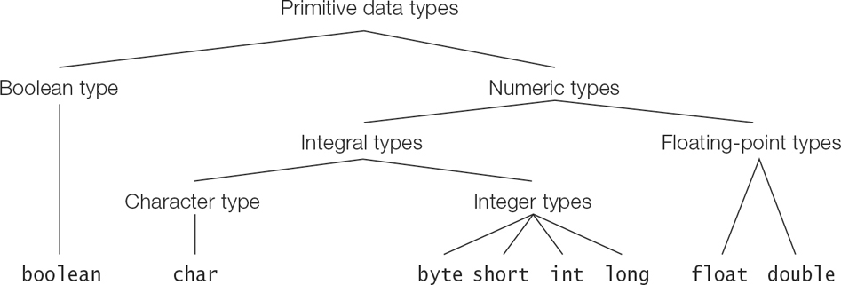

# Basic Language Elements
The basic language elements include low level elements using which high level constructs are formed.

### Lexical Tokens
Low level elements like Identifiers, numbers, operators, special character are called lexical token used to build 
high level constructs like expressions, statements, methods, and classes.

#### Identifier
Any name in the program is called an identifier, used to denote the name of classes, methods, variables and labels.
 - The identifier is named as a sequence of characters and digits, with the rule that identifier doesn't start with 
a digit.
 - The java program uses Unicode character set and thus the allowed character could be from different languages.
 - Underscore '_'(with other characters) and _currency_ symbols(such as $, ¢, ¥, or £) are also allowed.
 - '_' on itself is not a legal identifier but is a keyword in java(in SE17).

#### Keywords
Keywords are reserved words in java that can't be used as identifiers, that can't be used for naming any other entity.
 - All java keywords are lowercase and incorrect usage leads to compile-time error.
 - There are 3 types of keywords :
   1. Reserved Keywords. e.g. continue, while, synchronized, for, while etc
   2. Contextual keywords - restricted in certain context. e.g. exports, uses, opens, sealed.
   3. Reserved but not in use. e.g. goto, const

 - In addition, three identifiers are reserved, namely - true, false, null.

#### Separators
Separators(also known as _punctuators_) are tokens aiding compiler in syntax and semantic analysis.
 - {},(),[], ., ;, ..., @, ::
 - {} is used to contain a set of statements. Like-wise all separators have functions.

#### Literals
Literals are constant values in a java program. The values could be of all data types - int, char, float, boolean,
String.

##### Integer Literal
Integer data type comprises the following primitive data types - int, long, byte, short.

The default type for integer literal is int. For long, the literal should be appended with 'l' or 'L'. There is no
specification for short or byte.

Integer literal can be represented into all the number systems - namely binary, octal, decimal, hexadecimal.
 - binary - prefixed with '0b' or '0B'
 - octal - prefixed with '0'
 - hexadecimal - prefixed with '0x' or '0X'

 - '-' sign can be added regardless of the number system used. The number representation is just value, and we add sign
explicitly.

###### Representing Integers
 - Integer data types can represent both positive and negative values.
 - Can't assign a value out of the range for any integral types. Overflow and underflow calculations occur when the
arithmetic calculation over int literals results in out of range for that literal.
 - Value of Char types can be regarded as 16-bit unsigned integer. No cycle/overflow calculations for chars in java.
Further any value out of the range (0 to 2^16 -1)assigned to char will lead to compile time error. 
 - Java uses two's complement to store signed values of integer.
 - In bit representation, the MSB(Most Significant Bit) represents the sign of the integer.

###### Calculating two's complement
 - A number's 2-s complement is used to represent a negative number.
 - One's complement of a number is calculated by inverting all its bits in binary form. Represented by ~N.
 - Two's complement of a number is : 

```
   -N = ~N + 1; // One plus one complement of the number is negative of that number
```

 - Even subtraction is considered as a sum of a number with another number's 2-s complement.
 - As another matter of fact, byte, short, int, long are of size 8, 16, 32 and 64 bits.

##### Floating points Literals
This has two types, 1. Float 2. Double
 - Default type for this literal is double, that can be explicitly designated by appending 'D' or 'd'.
 - This literal can be assigned the type of float by appending with 'f' or 'F'.
 - Floating point literal can also be represented in scientific notation with exponent('E' or 'e'). 
```For e.g. - 1.95e3  = 1.95 * 10^3 = 1950```

 - E.g. of floating point literal.
49., 49.0D, 49.0, 49D, 4.9e1, 4900e-2, .49 etc represents double.  
49.f, 4.9e1f, 49F etc represents float. 

The decimal point(49.f/d can be represented as 49f/d) and exponent are optional.

##### UnderScores in Numeric Literals

 - Underscores can be added to numerical literals to enhance readability.
 - Any number of underscores can be added between digits of a numerical literal.
 - This rules out underscores adjacent to the sign (+, -), the radix prefix (0b, 0B, 0x, 0X), the decimal point (.), 
the exponent (e, E), and the data type suffix (l, L, d, D, f, F), as well as before the first digit and after the 
last digit. Note that octal radix prefix 0 is part of the definition of an octal literal and is therefore considered 
the first digit of an octal literal.
 - valid 0_35(035) but not _035

##### Boolean data type
This data type represents the truth value and is represented by literals true and false.

##### Character Literal
It is quoted in single quotes('). All of these literals have a char data type.
 - Represented by a 16 bit(2 byte) Unicode Character set.
 - It subsumes 8 bit ISO-Latin-1 and 7 bit ASCII characters.
 - A unicode character can be specified using 4 hexadecimal digit with a prefix '\u'(like '\u002a' etc).
 - We can also use the escape sequence \ddd where d is an octal value, with \377(total 256 values including 0) maximum 
value to represent characters.

##### Escape Sequences
 - Escape Sequences are special characters preceded by '\'(backslash), usually to change the cursor position in String.
 - All of these have a unicode value and can be used to denote escape sequences.
However, the Unicode values \u000a and \u000d should not be used to represent a newline and a carriage return in the 
source code.


|Escape sequence | Unicode value | Character                                     |
|----------------|--------------|-----------------------------------------------|
|\b              | \u0008       | Backspace (BS)                                |
|\t              | \u0009       | Horizontal tab (HT or TAB)                    |
|\n              | \u000a       | Linefeed (LF), also known as newline (NL)     |
|\f              | \u000c       | Form feed (FF)                                |
|\r              | \u000d       | Carriage return (CR)                          |
|\s              | \u0020       | Space (SP)                                    |
|\Line terminator| no unicode   | Line continuation in a text block             |
|\'              | \u0027       | Apostrophe-quote, also known as single quote  |
|\"              | \u0022       | Quotation mark, also known as double quote    |
|\\              | \u005c       | Backslash                                     |


##### String Literal

A sequence of characters enclosed within double quotes occurring on a single line.
 - All String literal are objects of String class.
 - Escape sequences and unicode values can appear in a String literal.
 - '(single apostrophe) need not to escaped in a String literal but in a char ('\'')
 - If a String is split up in multiple lines, it will throw compile time error.
 - All unicode values can be used expect \u000a and \u000d.

##### Whitespace

Whitespace is a sequence of space, tab, form feed, line terminator(newline, carriage return or both CRLF).
 - like separators, operators etc that helps in tokenizing a java program, whitespaces also helps in tokenization.

##### Comments

Used to put documentation in the code and is ignored by the compiler.
Java provides three types of comments : 
 - A Single line comment //
 - A multiple line comment /**/
 - A documentation(javadoc) comment. /** ...*/. Used by javadoc tool to generate HTML documents for the program.
Tags like @author, @version can also be used with this format.
 - Starting of comments(//, /*, /**) are not treated different to characters and hence nesting comments within comments
gives compile time errors (as the ending comments */ doesn't end properly).

#### Primitive Data Type


The primitive data type is divided into three categories:
1. Integral type - represents signed integer of byte, short, int, long and unsigned char.
 - byte is of 1 byte, short is 2 byte, int 4 byte, long 8 byte. And all of them are signed values using 2s complement.
 - char is of 2 byte and is unsigned representing all 16 bit unicode character set.
2. Floating-point types - represents fractional signed value.
3. Boolean type - represents logical values.

Each primitive type have a corresponding wrapper class.

###### Floating point values
Used to represent signed fractional values.
 - Two types, double and float.
 - zero can either be 0.0 or -0.0
 - float is of 4 bytes, double is of 8 bytes. double is wider than float.
 - Due to finite no of bits for representation, some values can be represented approximately.

All primitive dataType have a corresponding Wrapper Class like Boolean, Byte, Short, Character, Integer, Long, Float, 
Double.