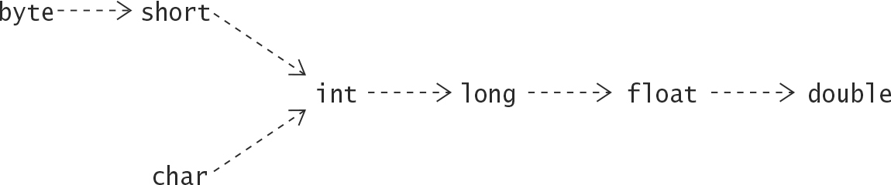

# Conversions

###### Widening and narrowing Primitive Conversions
For Primitive data type, the value of a narrower data type can be converted to a value of wider data type. This is 
called widening primitive conversion.



Conversions are transitive, meaning int can be directly converted to double, without going through the arrow.

Converting from a wider primitive type to a narrower primitive type is called a narrowing primitive conversion.
 - Conversion from char to two integer types byte, short is considered narrowing primitive conversions due to possible
lossy conversion.
 - Widening primitive conversions are done implicitly, whereas narrowing primitive conversion usually require a cast.
 - It's not illegal to use a cast for widening conversion.
 - Regardless of any loss of magnitude or precision, widening and narrowing primitive conversions never result in 
runtime exceptions.

###### Widening and Narrowing Reference Conversions
The subtype-superType relationship between reference types determines which conversions are permissible between them.
 - Conversion up the type hierarchy is called widening reference conversion(upcasting).
```
    Object obj = "Upcast me";   // Widening: Object is supertype
```
 - Conversions down the type hierarchy represent narrowing reference conversions(downcasting).
```
    String str = (String) obj;  // Narrowing: Object is supertype
```
 - A subtype is a narrower type than its supertype.
 - Widening conversions are usually implicit and narrowing conversions requires casting.
 - Widening reference conversions do not require any runtime checks and never result in an exception during execution.
 - Narrowing reference conversions requires runtime check and can throw ClassCastException if the conversion is not 
legal.

###### Boxing and Unboxing conversions
Interoperability between primitive values and objects of their corresponding Wrapper classes.
 - Boxing conversion converts the value of a primitive type to an object of corresponding Wrapper class.
 - Unboxing conversion converts the value of a Wrapper class object to a value of corresponding primitive type.
 - In the right context, both the conversions are applied implicitly, like adding wrapper objects of integral types
results in valid arithmetic.
 - Wrapper class provide a static method valueOf() to box primitive value and non-static method primitiveTypeValue() 
(e.g. doubleValue()) to explicitly unbox the value of wrapper object.
 - The implicit boxing conversion is called autoboxing.
```
    Integer a = 10;     //Autoboxing
    Double dRef = Double.valueOf(3.14);     //Explicit boxing
    
    int b = a;          //Implicit unboxing
    Double dVal = dRef.doubleValue();       //Explicit unboxing
```
 - Unboxing a wrapper reference that has null value results in a ___NullPointer-Exception___.

###### Other Conversion
 - Identity conversions allow conversions from a type to that same type. It is always permitted.
```
    int i = (int) 10;
    String str = (String) "Hello Shashwat"
```
 - String conversions allow a value of any other type to be converted to a String type in the context of the string 
concatenation operator +.
 - Unchecked conversions are permitted to facilitate operability between legacy and generic code.

#### Type Conversion Contexts
Conversions in each context occurs implicitly.
 - Assignment Context
 - Method Invocation
 - Casting
 - Numeric Promotion

###### Assignment Context
An assignment conversion converts the type of expression to the type of target variable.
 - An expression(or its value) is assignable to the target variable, if the type of the expression can be converted to
the type of the target variable by an assignment conversion.

###### Method Invocation
